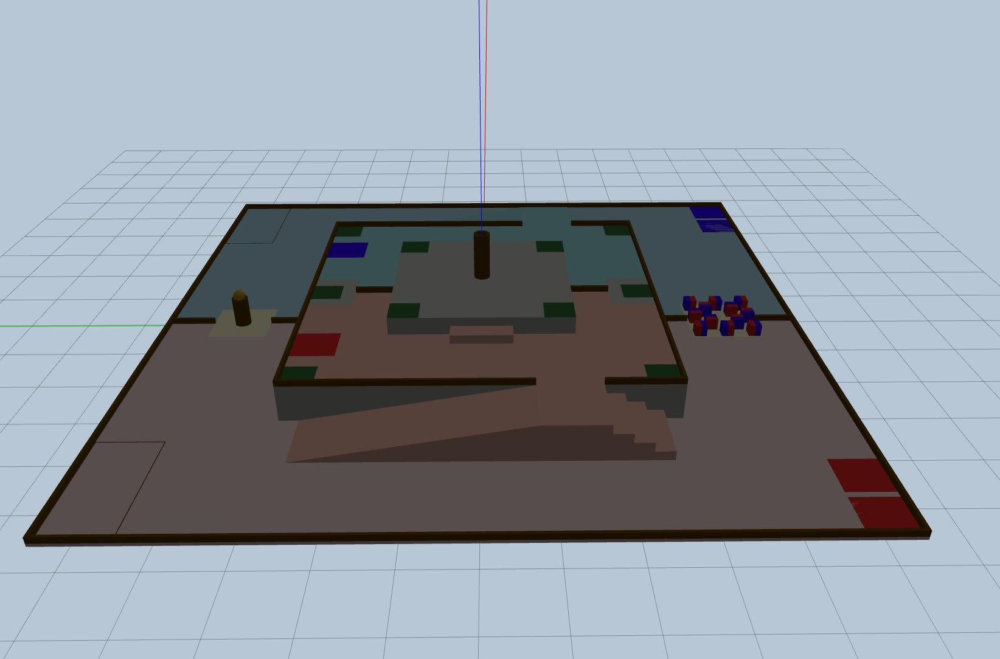

# ABU Robocon 2027 Gazebo 场地

ABU 亚太大学生机器人大赛 2027「追寻努山塔拉之灵石（The Pursuit of Mustika Nusantara）」的静态 Gazebo 场地模型。

项目将场地 STEP 装配转换为带碰撞和颜色的 SDF 模型，用于机器人导航、感知、路径规划及机构验证。仓库只维护场地资源，不提供参赛车辆、比赛道具实体、控制器或裁判/计分系统。



> 规则与尺寸摘要来自开发时使用的 ABU Robocon 2027 规则资料。正式比赛的规则、公告和 FAQ 以 ABU Robocon 官方最新版本为准。

## 内容

```text
robocon_2027_field/          Gazebo 场地模型
  meshes/                    完整场地碰撞网格
  visuals_fixed/             按部件拆分的彩色视觉网格
  model.config               Gazebo 模型元数据
  model.sdf                  静态模型、碰撞和材质定义
worlds/
  robocon_2027_classic.world Gazebo Classic 场景
launch/
  robocon_2027_field.launch.py  ROS 2 场地启动文件
pictures/  场地预览图
```

场地模型的 Gazebo 外包围盒约为 `11.1 m × 11.1 m × 1.75 m`，原点位于场地中心附近，地面高度约为 `z = 0`。源 CAD 使用毫米和 Y-up 坐标；模型中已完成米制缩放和 Gazebo 坐标旋转。

## 环境要求

- Ubuntu 22.04
- ROS 2 Humble
- Gazebo Classic 与 `gazebo_ros`
- `colcon`、`ament_cmake`

```bash
sudo apt update
sudo apt install \
  ros-humble-gazebo-ros-pkgs \
  python3-colcon-common-extensions
```

## 构建与启动

在仓库根目录构建：

```bash
source /opt/ros/humble/setup.bash
./build.sh
source install/setup.bash
```

启动场地：

```bash
ros2 launch robocon_2027_gazebo robocon_2027_field.launch.py
```

无界面运行：

```bash
ros2 launch robocon_2027_gazebo robocon_2027_field.launch.py gui:=false
```

也可以在已构建的工作空间中直接启动 world：

```bash
source /opt/ros/humble/setup.bash
source install/setup.bash
PACKAGE_SHARE=$(ros2 pkg prefix robocon_2027_gazebo)/share/robocon_2027_gazebo
export GAZEBO_MODEL_PATH="$PACKAGE_SHARE:${GAZEBO_MODEL_PATH:-}"
gazebo --verbose "$PACKAGE_SHARE/worlds/robocon_2027_classic.world"
```

## 接入自定义机器人

本仓库不绑定任何机器人模型。可在自己的 ROS 2 包中复用 `robocon_2027_classic.world`，并通过 `gazebo_ros/spawn_entity.py` 或自定义 launch 文件生成机器人。机器人初始位姿以 Gazebo 世界坐标的米为单位指定。

场地是静态碰撞体；请在你的项目中自行创建大地块、天空块、灵石等动态实体，并实现比赛策略、传感器和交互逻辑。

## 场地规格摘要

以下尺寸单位均为毫米。

| 项目 | 规格 |
| --- | --- |
| 比赛场地 | `11000 × 11000` |
| 起始区 / 地面重试区 | 两个 `700 × 700` |
| 存储区 | 每队 `1000 × 2000` |
| 地面共享区 | `1200 × 1200`；灵石基座周围另有 `1000 × 1000` 共享区 |
| 第一层 L1 | `6000 × 6000`，高出地面 `600`；坡道长 `3500` |
| 第二层 L2 | `3000 × 3000`，高出地面 `900` |
| 交接区 | `1000 × 1000`，位于 L1 边界 |
| 建造点 | `500 × 500` |
| 大地块 | `350 × 350 × 350` |
| 天空块 | `200 × 200 × 200` |
| 灵石 | 直径 `200` |
| 地面灵石基座 | 高 `500`、直径 `270` |
| L2 中央基座 | 高 `800`、直径 `270` |

## 场地预览

-2026-08-15T16_45_36.202817.jpg)

-2026-08-15T16_46_25.606779.jpg)

-2026-08-15T16_46_40.627813.jpg)

-2026-08-15T16_47_02.148857.jpg)

-2026-08-15T16_47_18.429997.jpg)
